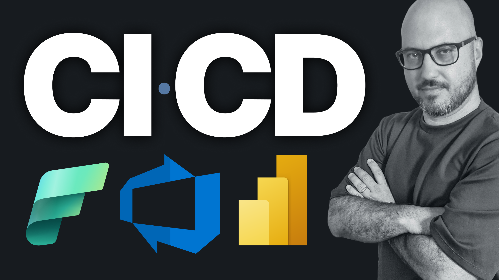
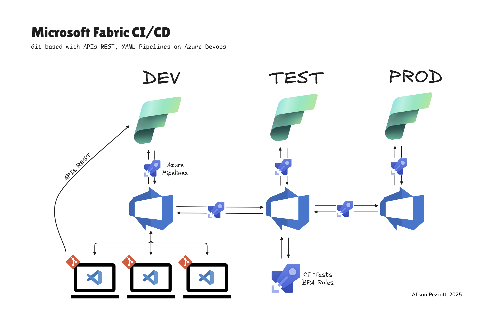
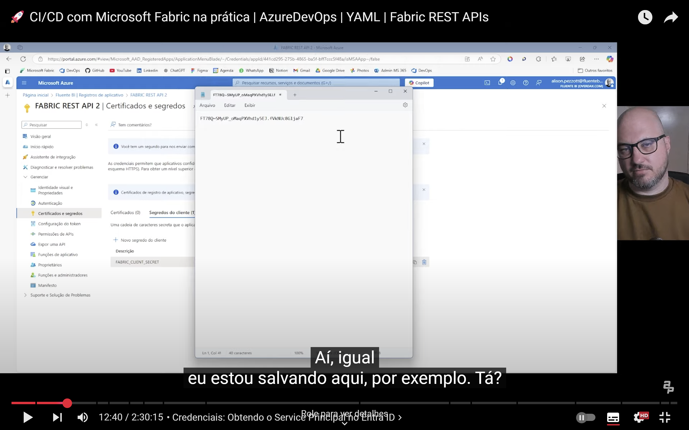

# 🚀 CI/CD com Microsoft Fabric na prática | AzureDevOps | YAML | Fabric REST APIs

> [!IMPORTANT]
> Este artigo vem complementar o vídeo publicado no canal: **🚀 CI/CD com Microsoft Fabric na prática | AzureDevOps | YAML | Fabric REST APIs** 

```html
<iframe width="560" height="315" src="https://www.youtube.com/embed/KiQYkk7_lis?si=VyY-j6O4ZgVUXlch" title="YouTube video player" frameborder="0" allow="accelerometer; autoplay; clipboard-write; encrypted-media; gyroscope; picture-in-picture; web-share" referrerpolicy="strict-origin-when-cross-origin" allowfullscreen></iframe> 
``` 

<a href="https://youtu.be/KiQYkk7_lis" target="_blank">
    
</a>

O vídeo demonstrou o desenvolvimento entre os estágios de DEV, TESTE e PRODUÇÃO integrando os Workspaces do Microsoft Fabric, Repositórios e Pipelines YAML  no Azure Devops e também versionando com o repositório Git Local utilizando: 

- Data Pipeline
- Notebook Spark
- Lakehouse
- Semantic model em Driect Lake
- Report  

Manipulando scripts Power Shell e APIs REST do Fabric executamos ações de criação de itens no Fabric, alteração de GUID's, testes dos modelos e ainda o deploy automatizado após o merge das versões publicadas. 

### O que é CI/CD? Como podemos aplicá-lo ao Microsoft Fabric  

CI/CD é uma abordagem moderna no desenvolvimento de software que significa "Integração Contínua" (Continuous Integration) e "Implantação Contínua" (Continuous Delivery/Deployment). Em resumo:

**Integração Contínua (CI)**: É o processo de integrar frequentemente as alterações de código feitas por diferentes desenvolvedores em um repositório central (como o Git). O objetivo é detectar erros rapidamente, automatizando testes e validações a cada mudança submetida.

**Entrega Contínua (CD)**: Vai além da CI, garantindo que o código testado esteja sempre pronto para ser implantado em produção manualmente, com processos automatizados até a etapa final.

**Implantação Contínua (CD)**: Uma extensão da entrega contínua, onde cada alteração que passa nos testes é automaticamente implantada em produção, sem intervenção manual.

Trazendo esta abordagem ao Microsoft Fabric, podemos automatizar e gerenciar o ciclo de vida de desenvolvimento, teste e implantação de soluções analíticas, como pipelines de dados, relatórios Power BI, notebooks e outros artefatos suportados pela plataforma. O Fabric, sendo uma solução unificada de análise de dados da Microsoft, possui integração com Git e pipelines de implantação para suportar práticas de DevOps, permitindo colaboração eficiente, controle de versão e entregas rápidas e confiáveis.  


> **Benefícios no Microsoft Fabric:**  
> - Colaboração: Vários desenvolvedores trabalham simultaneamente sem conflitos, usando controle de versão. 
> - Qualidade: Testes automatizados detectam problemas mais rapidamente.  
> - Agilidade: Implantações rápidas e consistentes aceleram a entrega.
> - Consistência: Ambientes refletem fielmente o código versionado, evitando "desvios de configuração".  
> - Segurança: Permite que qualquer estágio seja revertido quando necessário. 

## Exemplo prático  

  

O esquema acima esquema ilustra conceituamente o processo que executamos neste vídeo. 
Podemos ver claramente os três worskpaces em destaque: **DEV, TEST e PROD**
Estes mesmos workspaces estão sincronizados com os branches do repositóri remoto no Azure DevOps: **DEV, TEST e MAIN**, respectivamente. 
Por sua vez, o repositório remoto está sincronizado com o git local nas máquinas dos desenvolvedores.  

### Fluxo de desenvolvimento 

Os devs através de suas IDE's, como neste exemplo foi utilizado o VS Code, criam o repositório no Azure DevOps e fazem o clone para sua máquina local. Criam a branch e iniciam o desenvolvimento.  

Assim que o desenvolvimento é concluído, faz-se a sincronização do workspace Fabric com os repositórios remotos e faz-se o checkout da branch test e são exetudados testes através de pipelines, como no vídeo apresentado, foi testado o script de BPA Rules do Tabular Editor para o semantic model e PBIX inspector para o report.  

Quando aprovado, é solicitado o Pull Request para o branch main. Assim que aprovado, aceito e o merge do branch é concluído executa-se o sync com o workspace no Fabric. 

Por estarmos tratando de workspaces e fontes diferentes, neste processo inicial, tomamos os cuidados com os GUIDs de conexão entre cada operação de merge para que os itens do Fabric não se misturem entre os workspaces, desta forma, mantendo totalmente segregado cda workspace Fabric com cada branch de desenvolvimento. Para isso usamos inclusive arquivo `config.json` que durante o processo foi cooletando cada um destes GUIDs.  

```json
{
  "global": {
    "capacity_id": "ac0792da-1613-40d6-bf33-c5ea3627f231",
    "project": "Fabric_CI_CD_Demo_01"
  },
  "dev": {
    "workspace_name": "Fabric_CI_CD_Demo_01_DEV",
    "lakehouse_name": "lakehouse_001",
    "pipeline_name": "pipeline_001",
    "gateway_connection_id": "6a607f35-54e0-491c-89be-0dff4a47ab00",
    "workspace_id": "61ccbc85-3f00-453a-9ed8-d897d902cef7",
    "lakehouse_id": "265cbc4c-a79c-4e4d-8352-176d15dca39a",
    "sql_lakehouse_id": "8683483a-9000-420f-a0d5-259e9c98d223",
    "sql_connection_string": "gvkmt76pz4cuhm2fs63qgxl5cy-qw6myyiah45elhwy3cl5sawo64.datawarehouse.fabric.microsoft.com"
  },
  "test": {
    "workspace_name": "Fabric_CI_CD_Demo_01_TEST",
    "lakehouse_name": "lakehouse_001",
    "pipeline_name": "pipeline_001",
    "gateway_connection_id": "f0034fc6-7d6d-4b52-9377-ec2d0679f7b6",
    "workspace_id": "9f60e532-57b6-4c8f-a5f5-4319ef7c1a34",
    "lakehouse_id": "49e0068f-e446-43e8-b7a2-907a485aeef7",
    "sql_lakehouse_id": "91d7f3b8-8849-46d5-9bff-8ddc832907b9",
    "sql_connection_string": "gvkmt76pz4cuhm2fs63qgxl5cy-glswbh5wk6huzjpvimm667a2gq.datawarehouse.fabric.microsoft.com"
  },
  "prod": {
    "workspace_name": "Fabric_CI_CD_Demo_01_PROD",
    "lakehouse_name": "lakehouse_001",
    "pipeline_name": "pipeline_001",
    "gateway_connection_id": "d56e65fe-747e-41e2-8e5a-2f9523e6910d",
    "workspace_id": "50cd1314-7aa2-4feb-aedd-0f793e7811e0",
    "lakehouse_id": "d8686c94-027d-4883-b40f-897412fb3e0f",
    "sql_connection_string": "gvkmt76pz4cuhm2fs63qgxl5cy-cqj42ufcplvu7lw5b54t46ar4a.datawarehouse.fabric.microsoft.com",
    "sql_lakehouse_id": "9b021d36-2b15-4536-8859-90b19b1ddcdd"
  }
}
```  


### Fabric APIs REST  

A Microsoft disponibiliza no porta no Learn a documentação das [Fabric API's REST](https://learn.microsoft.com/en-us/rest/api/fabric/articles/). Estas API's são as responsáveis por permitir a automatização dos processos de manipulação dos workspaces Fabric e seus itens como lakehouses, semantic models, reports etc.

Alguns destes endpoints funcionam com autenticação por Services Principals e outras por User e Password.  

Acompanhe as instruções no vídeo a partir do minuto [00:05:37](https://youtu.be/KiQYkk7_lis?t=338) para obter as credenciais necessárias no Microsoft Entra.  

  

> [!WARNING]
> Após as configurações das credenciais realizadas, você deve conferir no portal de administração do Fabric se as opções estão habilitadas que utilizem API's do Fabric em sua organização. Basta seguir as instruções do vídeo.  

#### Scripts PowerShell e Yaml

Para este case, foram desenvolvidos scripts PowerShell contendo operações que seriam realizadas manualmente e também scripts que serão os responsáveis por automatizar o processo. 

Todos os scripts foram disponilibizados no repositório no GitHub que pode ser baixado [aqui](https://github.com/alisonpezzott/fabric-ci-cd/releases/tag/v1.0.0).  Inclusive acompanhe o repositório, pois o mesmo irá crescer ao modo que meus estudos neste quesito forem avançando.  


Os scripts PowerShell (*.ps1) foram desenvolvidos de forma modular, que facilita a manutenção e a reutilização dentro de outros scripts e tbm dentro dos pipelines. Eles acessam diretamente o Fabric e realizam ações importantes para o processo de CI/CD.  

Segue abaixo a lista dos scripts disponibilizados segundo a ordem de utilização e a sua descrição. 

`scripts/list_capacities.ps1`

Lista as capacidades no seu tenant possibilitanto escolher qual capacidade para configurar em seus workspaces. Inclua o id da capacidade no config.json.global.capacity_id  

`set_workspace.ps1`  

Se não existir cria um novo workspace. Atribue a capacidade. Dá permissões aos usuários especificados e salva as ID do workspace para cada branch no config.json.\<branch>.workpace_id  

`set_lakehouse.ps1`  

Se não existir cria um novo lakehouse. Captura as connection strings necessárias e as salva para cada branch em:  
- config.json.\<branch>.lakehouse_id
- config.json.\<branch>.sql_lakehouse_id
- config.json.\<branch>.sql_connection_string  

`replacement_data_pipeline.ps1`  

Script para trocar a conexão do gateway dentro do pipeline. Neste exemplo, nós simulamos uma base para cada branch onde na dev nossa tinha 10K linhas, em test 100k linhas e em prod 1 milhão de linhas. Este script é o responsável por manter cada base em eu seu workspace.  

`replacement_notebook.ps1`

Script para trocar o nome do workspace dentro do notebook spark para que seja dinâmico para cada branch criado. A idéia foi ser o mais dinâmico sem ficar travado ao lakehouse padrão do notebook. 

`replacement_semantic_model`  

Script para troca dos GUIDs dentro do arquivo expression.tmdl do semantic models em direct lake.
Essas strings apontam para o Lakehouse qua contém os dados propriamente ditos. Caso, não fosse alteradas todas as branchs continuariam apontando sempre para o workspace dev e isso não é o que queremos. 

`git_init.ps1`  

Script para inicializar a integração git do Fabric com o Azure DevOps sem a necessidade de acessar o Fabric para isso. 

`update_from_git.ps1`  

Após inicializada a integração do git, roda-se este script para sincronizar os itens do repositório remoto do Azure DevOps com o Fabric. Estruturas de repetição foram criadas para que a atualização seja assegurada.  

`run_data_pipeline.ps1`  

Script para popular os lakehouse com os dados após a sincronização dos códigos.

> [!IMPORTANT]
> A integração e alteração dos códigos não afetam os dados carregados no Lakehouse. Portanto é necessário popular o Lakehouse mesmo que ele venha de uma branch criada de um workspace já populado. Por exemplo, caso faça um checkout de uma nova branch a partir da prod já em produção. Todos os metadados serão copiados para a nova branch, porém o lakehouse estará vazio. É necessário popular as tabelas.
> Contudo, alterações de metadados em Lakehouses já populados não alteram os dados já carregados, apenas os metadados.  

#### Pipelines YML

`cd_checkout_new_branch.yml`  

Código para utilização nos pipelines no Azure DevOps. Este pipeline combina alguns dos scripts PowerShell de forma ordenada para realizar a operação de criar um novo branch a partir de um existente. Muito útil em processos de feature, por exemplo, para algo pontual, pode-se rodar este yml para criar uma branch a partir da main e seguir o fluxo normal.  

`ci_model_repost_tests.yml`  

Código de testes de boas práticas para os semantic models e reports. Elaborado por Rui Romano e disponibilizado pela Microsoft em seu [GitHub](https://github.com/microsoft/Analysis-Services/blob/master/pbidevmode/sample-ado-pipelines/ContinuousIntegration-Rules.yml) este pipeline checa questões de relacionamentos, escritas de medidas, colunas desnecessárias, sumarizações, entre outros itens utilizando Tabular Editor CLI.  

`cd_pull_request_main.yml`  

Este pipeline executa o deploy propriamente dito assim que for concluído um merge para a branch main de forma automática. Ou seja, após o desenvolvimento concluído, testado e aprovado é solicitado o Pull Request de outra branch para a main. Assim que aprovado e o merge realizado o pipeline detecta esta operação, faz o check dos GUID's e altera se for necessário e faz o update_from_git para o Fabric concluído assim o processo de CI/CD. 

## Conclusão

Neste artigo e vídeo vimos as inúmeras vantagens em empregar CI/CD com Microsoft Fabric. Entender os resquisitos e desdobramentos para o sucesso deste processo. 
Vimos como as Fabric REST APIs aliadas ao Git e aos Azure Pipelines, fornecem um arsenal para automatização, controle, segurança e produtividade.
Quero ouvir de você o que você achou deste artigo e vídeo. Escreva nos comentários se já utiliza CI/CD em seus processos ou se pretende implantar.
Compartilhe com sua rede, pois isso ajuda a nossa comunidade de Microsoft Fabric no Brasil (Quem sabe mundo?!) cresça ainda mais.

Não deixe de me acompanhar nos canais abaixo:

YouTube: youtube.com/@alisonpezzott  
Linkedin: linkedin.com/in/alisonpezzott  
Instagram: instagram.com/alisonpezzott  
GitHub: github.com/alisonpezzott  
Discord: discord.gg/sJTDvWz9sMTelegram:   
t.me/alisonpezzott


Um forte abraço e até mais!


